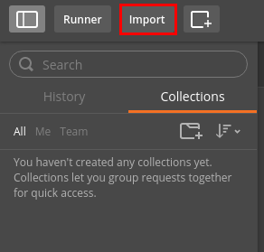
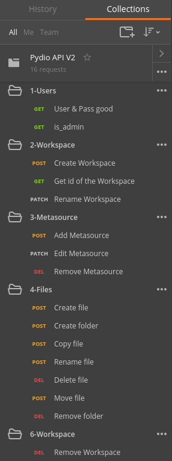
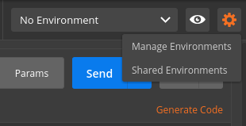
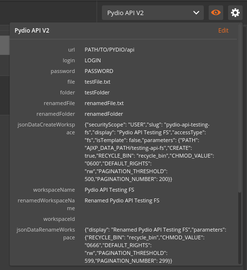
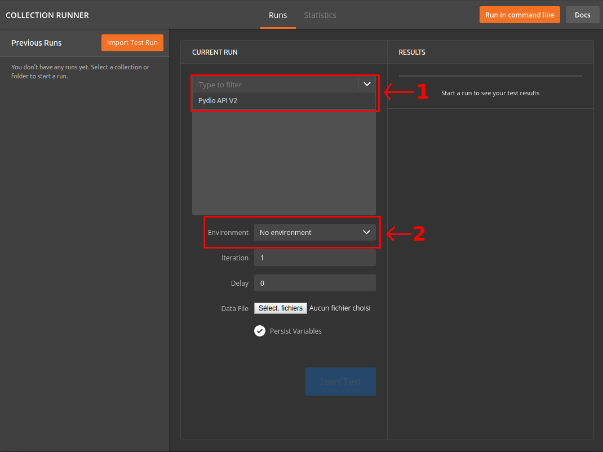
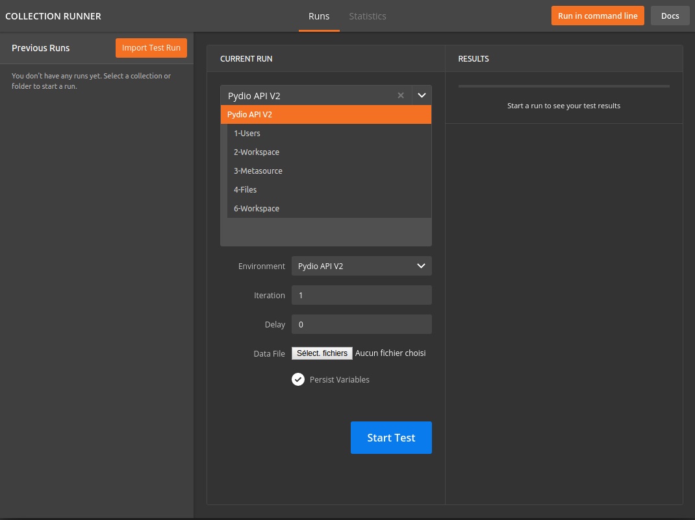

#Pydio API Testing

##What is it ?
Pydio API Testing provides two files to test your Pydio's API (currently V2) with [Postman](https://www.getpostman.com/) or [Newman](https://www.npmjs.com/package/newman)

##Disclaimer
Before start testing you must have an installed Pydio. If you don't know how to install one, you can check this [guide](https://pydio.com/en/docs/v6/install-pydio).
After the installation, you can change 3 values in `Pydio.postman_environment.json`: the url of your Pydio and your pydio user's credentials.
For exemple if your Pydio url is `http://192.168.0.68/pydio` and you login with admin/secret you must change this
```
{
      "key": "url",
      "value": "PATH/TO/PYDIO/api",
      "type": "text",
      "enabled": true
    },
    {
      "key": "login",
      "value": "LOGIN",
      "type": "text",
      "enabled": true
    },
    {
      "key": "password",
      "value": "PASSWORD",
      "type": "text",
      "enabled": true
    },
```
to this
```
{
      "key": "url",
      "value": "http://192.168.0.68/pydio/api",
      "type": "text",
      "enabled": true
    },
    {
      "key": "login",
      "value": "admin",
      "type": "text",
      "enabled": true
    },
    {
      "key": "password",
      "value": "secret",
      "type": "text",
      "enabled": true
    },
```
You can also leave the file untouched and edit the environment variables directly in Postman.

##How to use it ?
###With Postman
First you need to import the `Pydio.postman_collection.json` file as a Collection.
Click to the `Import` button at the top left of Postman and choose the `Pydio.postman_collection.json` file.  

  

After the import you must see the collection like this  

  

This collection refers to a Postman environment. Click to the 'wheel' button to `Manage environments` at the top right of Postman and choose the `Pydio.postman_environment.json` file.  

  

After the import you can see the environment if you click to the eye. If you did not manually edit the environment file, use "Edit" to setup the correct values for your server URL and credentials. 

  

Collection and environment file are imported, we can test our Pydio's API. Click to the `Runner` button at the top left of Postman.  

  

A second screen will appear and you need to select `Pydio API V2` as collection (in the 1) and `Pydio API V2` as an environment (in the 2).  

  

If you do that you must see this.

  

You can now start the test

###With Newman

First go to the folder where is `Pydio.postman_collection.json` and `Pydio.postman_environment.json` with a terminal.  
After that you need to write `newman -c Pydio.postman_collection.json -e Pydio.postman_environment.json` to start the test in command-line.